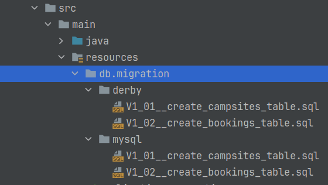

Another year passed, and I decided to return to this project again and implement a new batch of
improvements. So, continuing the
series ["Campsite Booking API (Java)"](/series/campsite-booking-api-java/) with this installment, I
detail changes to the project and its current state.

<!--more-->

Before I started any development on this iteration, I came up with a list of changes, which I
formalized using
GitHub's [projects](https://docs.github.com/en/issues/planning-and-tracking-with-projects/learning-about-projects/about-projects)
feature. To do so, I created
the [Campsite Booking 2023](https://github.com/users/igor-baiborodine/projects/1/views/1) project
with all the items I wanted to implement. Creating such a project helped me illustrate the scope of
the new iteration, plan my work, and track progress. And now, let's give more details of the most
significant changes.



### Upgrade to Spring Boot 3

Since Spring Boot 3
was [released](https://github.com/spring-projects/spring-boot/wiki/Spring-Boot-3.0-Release-Notes)
almost a year ago, this project was well due for an upgrade from version 2 to version 3. Given that
this project was already using Java 17 LTS, which is the main prerequisite for Spring Boot 3
migration, the upgrade consisted of bumping the version of the `spring-boot-starter-parent` artifact
from `2.7.1` to `3.1.4`. Also, given that Spring Boot 3 moved from Java EE to Jakarta EE APIs for
all dependencies, I had to replace all `javax` imports with `jakarta` ones. 

Check
this [commit](https://github.com/igor-baiborodine/campsite-booking/commit/c55811131fc34928e084f77e72ae0570e972d882)
for more details.

### Entity Classes for the DB Layer

This sample project is based on the layered architecture that consists of the
presentation(`BookingController.java` class back then, later renamed
to `BookingApiControllerImpl.java`), business(`BookingService.java class`),
persistence(`BookingRepository.java` class), and database(MySQL or Derby DBs) layers. Each of the
first three layers typically operates with its proper object classes, namely, data transfer object(
DTO), model, and entity classes, respectively.

But back then, it was implemented so that the business and persistence layers operated on the same
object class, namely Booking.java. So, to make all layers work on their proper object classes, I
added an entity object class named `BookingEntity.java` for the persistence layer. 

Check
this [commit](https://github.com/igor-baiborodine/campsite-booking/commit/e2b91df8666561aaab933a936aa2e2ff93e7bdb1)
for more details.

### Explicit given-when-then Pattern for Tests

When introducing the entity object class for the persistence level, I had to update the
corresponding unit and integration tests. During the previous iteration, I rewrote all unit and
integration tests
using [JUnit 5 in BDD style](https://www.kiroule.com/article/campsite-booking-api-revisited-2/#tests-with-junit-5-in-bdd-style),
which turned out to be a wrong decision. It's more challenging to make significant changes to the
test methods when the code in it for the `given`, `when`, and `then` parts are encapsulated in
methods prefixed with `given_`, `when_`, and `then_` parts, respectively.

So, to solve this issue, I reworked all unit and integration tests again with an
explicit `given-when-then` pattern using the following convention:

* All tests related to a particular method should be encapsulated in a nested class annotated with
  the JUnit 5 `@Nested` annotation.
* The instance variable for the class under test should be named `classUnderTest`.
* Methods that test a happy path execution should be named `happy_path`. Methods that test other
  preconditions and inputs should be
  named `given_<preconditions_and_inputs>__then_<expected_results>`.
* Code within a test method should be laid out per the `given-when-then` pattern with the
  explicit `// given`, `// when`, and `// then` comments to improve readability and facilitate
  visualization of the corresponding code blocks.
* The when part should only contain the invocation of the method under the test and the variable to
  which the result of this invocation is assigned should be named `result`.

Also, the BDD style does not play well with the parallel execution of tests since it forces the use
of test class instance variables shared between the test methods. 

Check
this [commit](https://github.com/igor-baiborodine/campsite-booking/commit/579b4a74ab91159c2ef85d240d1d7007373a8f0f#diff-90ccdaedf224b4323b0c4c71c7d43a589ad486af9415e4a07d389763ca3d8a69)
for more details.

### Test Containers for Integration Tests

Previously, to implement integration tests, I used
the [Apache Derby database](https://db.apache.org/derby/). But recently, I discovered a
better alternative to it: a [MySQL test container](https://testcontainers.com/modules/mysql/), which
is part of the Testcontainers open-source framework for providing lightweight instances of almost
anything that can run in a Docker container.

To implement the migration to the MySQL test container, firstly, I had to add two new dependencies
to the `pom.xml` file:

```xml
<dependency>
  <groupId>org.testcontainers</groupId>
  <artifactId>testcontainers</artifactId>
  <version>1.19.1</version>
  <scope>test</scope>
</dependency>
<dependency>
  <groupId>org.testcontainers</groupId>
  <artifactId>mysql</artifactId>
  <version>1.19.1</version>
  <scope>test</scope>
</dependency>
```

Secondly, I updated the `BaseIT.java` class by adding the container and corresponding Spring data
source properties initializations:

```java
@SpringBootTest(webEnvironment = RANDOM_PORT)
@ActiveProfiles("mysql")
public abstract class BaseIT {

  private static final String MYSQL_DOCKER_IMAGE_NAME = "mysql:8-debian";
  private static final String MYSQL_DATABASE_NAME = "test_campsite";

  static final MySQLContainer<?> mySqlContainer;
  static {
    mySqlContainer =
        new MySQLContainer<>(MYSQL_DOCKER_IMAGE_NAME).withDatabaseName(MYSQL_DATABASE_NAME);
    mySqlContainer.start();
  }

  @DynamicPropertySource
  static void mysqlProperties(DynamicPropertyRegistry registry) {
    registry.add("spring.datasource.url", mySqlContainer::getJdbcUrl);
    registry.add("spring.datasource.username", mySqlContainer::getUsername);
    registry.add("spring.datasource.password", mySqlContainer::getPassword);
    registry.add("spring.jpa.properties.hibernate.show_sql", () -> "true");
  }
}
```

Check
this [commit](https://github.com/igor-baiborodine/campsite-booking/commit/d56c4407a360f68e342e479dc2f41d315bb131ae)
for more details.

### Flyway Migrations

Another enhancement implemented is the database migrations or versioning
using [Flyway](https://documentation.red-gate.com/fd/quickstart-how-flyway-works-184127223.html), an
open-source database migration tool. Previously, the database schema was created or updated on every
application initialization using Spring Data JPA's built-in schema generation feature by defining
the `spring.jpa.hibernate.ddl-auto` property in the application properties file.

So, to implement this feature, I started by adding two new dependencies to the `pom.xml` file:

```xml
<dependency>
  <groupId>org.flywaydb</groupId>
  <artifactId>flyway-core</artifactId>
  <version>9.22.3</version>
</dependency>
<dependency>
  <groupId>org.flywaydb</groupId>
  <artifactId>flyway-mysql</artifactId>
  <version>9.22.3</version>
</dependency>
```

Then, while removing the `spring.jpa.hibernate.ddl-auto` property in the application properties
file, I added two new DDL SQL migration scripts for MySQL and Apache Derby vendors, which were
placed into the default location for Flyway scripts, namely, the `db/migration` folder:



Also, since I provided migration scripts for two vendors, I had to define
the `spring.flyway.locations` application property as follows:

```properties
spring.flyway.locations=classpath:db/migration/{vendor}
```

Depending on the data source used, the `{vendor}` placeholder will be replaced automatically with
either `mysql` or `derby` value on application start.

Check
this [commit](https://github.com/igor-baiborodine/campsite-booking/commit/c185f58903dd9af924b9d28a844ca45d2a55607a)
for more details.

### Continuous Integration

// TODO

Continue reading the series ["Campsite Booking API (Java)"](/series/campsite-booking-api-java/):

