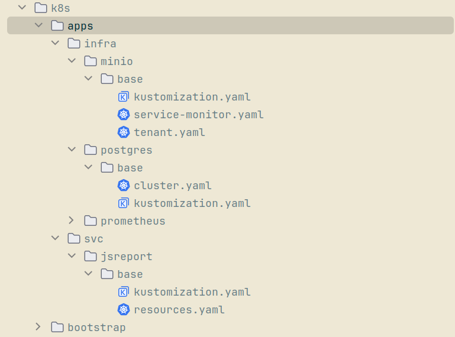
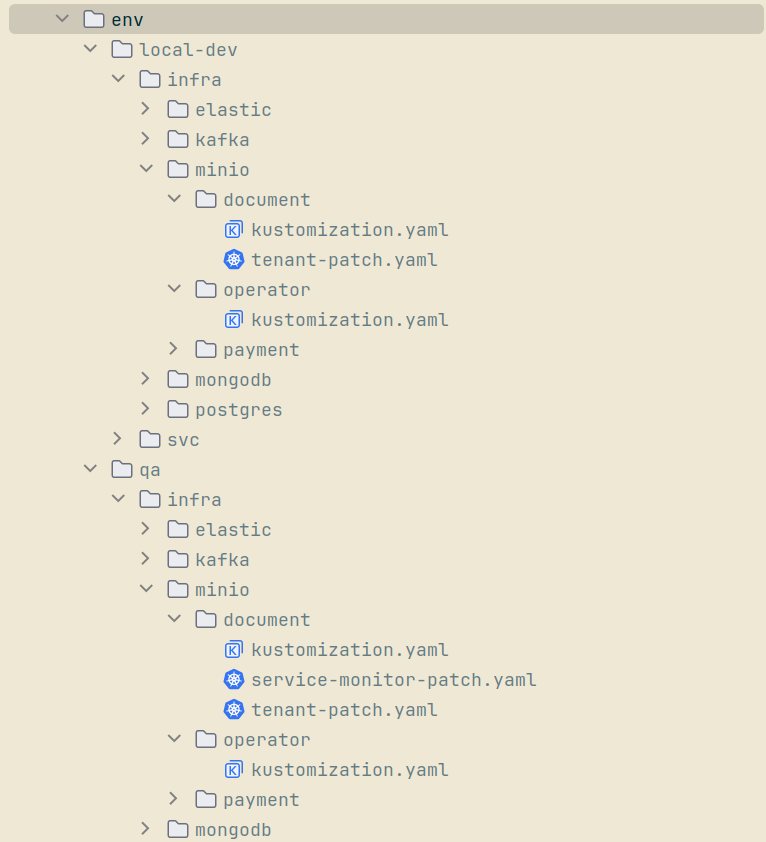

In the inaugural [post](/article/from-java-to-go-kicking-off-the-insurance-hub-transformation/) of
the ["Insurance Hub: The Way to Go"](/series/insurance-hub-the-way-to-go/) series, I outlined the
ambitious strategy for modernizing a Java-based insurance system into a cloud-native Go application.
With the roadmap established, the past two months have focused on transitioning from architectural
diagrams to hands-on engineering. This article chronicles the execution
of [Phase 1](https://github.com/igor-baiborodine/insurance-hub/blob/main/docs/system-overview-and-migration-analysis.md#phase-1-foundational-infrastructure--environment-migration-lift-and-shift),
which involves a foundational "lift and shift."

<!--more-->

This phase moves the entire legacy application from
the familiar confines of Docker Compose into a robust, production-like Kubernetes environment. By
establishing parallel clusters—using Kind for local development and K3s for production-like QA—this
critical first step, representing the metaphorical "lift," validates the new platform and lays the
stable groundwork necessary for the upcoming deeper service-by-service "shift" migration.

The scope of this article covers the foundational infrastructure "lift" phase of migrating the
Insurance Hub to Kubernetes, specifically:

- Provisioning local development and QA Kubernetes clusters using Kind and Rancher’s K3s, creating
  production-like environments for testing and validation.
- Deploying core cluster observability tools, including Prometheus and Grafana for metrics and
  monitoring, plus Zipkin for distributed tracing of Insurance Hub services.
- Deploying core infrastructure components essential to the Insurance Hub, such as PostgreSQL,
  MongoDB, Elasticsearch, Apache Kafka, and introducing MinIO as the new S3-compatible object
  storage replacement for the existing filesystem.
- Deploying auxiliary services like JSReport to support the Insurance Hub's PDF generation
  capabilities.

This second installment focuses on establishing the cloud-native platform foundation by replicating
the existing environment within Kubernetes. Targeted Java service modifications and gateway
deployment are part of the next "shift" phase and will be covered later. This lift ensures minimal
disruption while validating stable operation on the Kubernetes infrastructure.



### Phase 1 Planning and Scoping

Before starting Phase 1, a thorough review and adjustment of its scope were essential to ensure a
smooth and effective migration process. This included researching best practices for both local
development and production-like Kubernetes environments. It became clear that observability should
encompass not only the Insurance Hub services but also the underlying infrastructure components,
providing comprehensive monitoring and troubleshooting capabilities. During this review, the
importance of deploying Zipkin for distributed tracing and JSReport for PDF generation was
recognized and added to the scope. Furthermore, implementing GitOps early in the migration was
deemed necessary to maintain consistency and automation, prompting its migration from Phase 6 to
Phase 1.

Once the scope was finalized, the first
epic [ticket](https://github.com/users/igor-baiborodine/projects/8/views/1?pane=issue&itemId=124052445&issue=igor-baiborodine%7Cinsurance-hub%7C5)
for Phase 1 was created in the "Insurance Hub - Go Migration" project, followed by more granular
tickets that were aligned with the scope. To streamline ticket creation, the Junie AI coding agent
was employed to assist in drafting detailed descriptions based on a standardized template. For
managing the workflow, all new tickets initially enter the "Backlog" column and must pass through a
refinement process before being moved to "Ready." This process includes validating ticket descriptions
and acceptance criteria, conducting necessary research—such as evaluating whether to use ArgoCD or
Flux for GitOps—and updating the "Dev Notes" section. This structured approach ensures clear
communication, proper preparation, and prioritization, setting a strong foundation for executing the
lift phase of the migration.

### Provisioning Clusters

Since the Kubernetes cluster forms the foundation and starting point of the entire migration, I
carefully evaluated available tools and options to find a solution that balances resource efficiency
with the capability to handle complex networking, storage, and production-like workloads. The goal
was to host a distributed system consisting of six Java/Go microservices alongside stateful components
and comprehensive observability tools.

Given my extensive experience using [Kind](https://kind.sigs.k8s.io/)-based Kubernetes clusters for
local development at my current job, it was an obvious choice to leverage Kind again for the
Insurance Hub’s local development environment.

For the production-like QA environment, I considered two main options: using a well-known cloud
provider's managed Kubernetes service or setting up a local, fully compliant (or close to fully
compliant) Kubernetes environment. I opted for the latter based on several factors: eliminating
cloud infrastructure costs by utilizing existing hardware that has ample CPU and RAM, gaining
complete administrative control for deep customization, and acquiring hands-on experience managing a
production-like cluster, which deepens Kubernetes expertise.

Initially, I chose [MicroK8s](https://microk8s.io/) for the production-like simulation because it
offers a complete, conformant Kubernetes environment with many built-in addons for common
functionalities such as DNS, ingress, storage, metrics, and monitoring. However, deploying and
configuring MicroK8s proved to be resource-intensive and time-consuming.

After additional research and testing, I switched to Rancher's [K3s](https://k3s.io/). While K3s is
not 100% fully conformant with Kubernetes, it is very close and ideally suited for simulating a
production environment locally without excessive resource consumption or a complex setup. K3s strikes
an excellent balance between providing a full-fledged Kubernetes experience and maintaining
development machine efficiency.

Since [Make](https://www.gnu.org/software/make/) is widely used in Go projects, I chose to leverage
it extensively for automating and reliably reproducing every step involved in creating clusters and
deploying both infrastructure and service components. To maintain consistency and readability while
relying on Makefiles, I added a dedicated style
guide [section](https://github.com/igor-baiborodine/insurance-hub/blob/main/CONTRIBUTING.md#makefile)
to the `CONTRIBUTING.md` file, outlining the best practices for using Make within the project. 

In addition, the [Prerequisites](https://github.com/igor-baiborodine/insurance-hub/blob/main/CONTRIBUTING.md#prerequisites)
section was added to clearly document all required dependencies. This ensures everything is provided
from the developer’s perspective for smooth development and proper operation of the Insurance Hub
within a Kubernetes cluster. Before proceeding with creating clusters, all necessary dependencies
should be installed and configured correctly. To facilitate this process, I created a helper Make
target named [prereq-k8s-all](https://github.com/igor-baiborodine/insurance-hub/blob/947f3e492e50e7efbcfa15762e6d54613be4ff85/k8s/Makefile#L72)
that automates it.

#### Local Dev

Setting up a Kind cluster is straightforward and fast, making it ideal for iterative development of
the Insurance Hub’s six Java/Go microservices and accompanying infrastructure. To make cluster
operations repeatable and error-free, I created
several [Make targets](https://github.com/igor-baiborodine/insurance-hub/blob/947f3e492e50e7efbcfa15762e6d54613be4ff85/k8s/bootstrap/Makefile#L24):

- `local-dev-create` - creates and starts a single-node Kind cluster
- `local-dev-delete` - stops and removes the cluster and its persistent storage
- `local-dev-suspend` - stops the cluster without deleting it
- `local-dev-resume` - starts the suspended cluster again

All steps required to create and manage the Kind cluster are documented in
the ["Local Dev"](https://github.com/igor-baiborodine/insurance-hub/blob/main/k8s/base-cluster-how-tos.md#local-dev)
section of the "Base Cluster How-To's" guide.

#### Production-like QA

To make the QA environment closely reflect a production setup, I used LXD-based virtual machines as
cluster nodes instead of Docker containers. Canonical's [LXD](https://canonical.com/lxd) provides
stronger isolation and better compatibility with production-like environments while remaining
lightweight enough for local development.

My development machine is equipped with 24 logical CPUs (16 physical cores) and 64 GB of RAM. Since
the Kubernetes control plane components—such as the API server, scheduler, controller manager, and
etcd—are resource-intensive, I allocated more CPU and memory to the master node. The resources were
distributed as follows, dedicating half of the available machine’s resources to the future cluster:

- Master LXD VM: 6 CPU, 16 GiB RAM
- Worker LXD VM 1: 3 CPU, 8 GiB RAM
- Worker LXD VM 2: 3 CPU, 8 GiB RAM

Similar to the local development setup, I implemented a suite
of [Make targets](https://github.com/igor-baiborodine/insurance-hub/blob/947f3e492e50e7efbcfa15762e6d54613be4ff85/k8s/bootstrap/Makefile#L65)
to ensure consistent and reliable management of QA cluster operations:

- `qa-nodes-create` – Creates three LXD VMs (one master, two workers).
- `qa-nodes-suspend` – Pauses all QA VMs.
- `qa-nodes-resume` – Resumes suspended VMs.
- `qa-nodes-snapshot` – Creates snapshots for backup or rollback.
- `qa-nodes-snapshots-list` – Lists existing snapshots.
- `qa-nodes-restore` – Restores VMs from a snapshot.
- `qa-nodes-delete` – Deletes all QA VMs and snapshots.

These targets wrap underlying `lxc` commands and scripts to automate the lifecycle of QA cluster
nodes. Because provisioning and deploying QA environments can be time-consuming, the
`qa-nodes-snapshot` target is particularly valuable for quick backups, rollbacks, and recovery.

Before deploying the K3s cluster on these VMs, the host system’s firewall and network routing must
be properly configured. Kubernetes networking depends on the host’s ability to forward packets
between interfaces for pod-to-pod and external communication. Many Linux distributions default to
dropping forwarded packets, which blocks this traffic. Setting the `iptables` `FORWARD` chain policy
to `ACCEPT` resolves this issue. Detailed instructions are provided in
the [“Prerequisites”](https://github.com/igor-baiborodine/insurance-hub/blob/main/k8s/base-cluster-how-tos.md#prerequisite)
section of the “Base Cluster How-To’s” guide.

Following the creation of VMs, the K3s-based cluster can be deployed with the `qa-cluster-create` and
`qa-cluster-pull-kubeconfig` [Make targets](https://github.com/igor-baiborodine/insurance-hub/blob/947f3e492e50e7efbcfa15762e6d54613be4ff85/k8s/bootstrap/Makefile#L50).
The cluster includes essential addons such as DNS, ingress, and storage by default. The second
target updates the `kubeconfig` file with the master’s IP address, adjusts context names for
clarity, and merges the configuration into the host’s default `kubeconfig`, enabling direct local
access to the QA cluster.

All steps required to create and manage the QA cluster are described in
the [“QA”](https://github.com/igor-baiborodine/insurance-hub/blob/main/k8s/base-cluster-how-tos.md#qa)
section of the “Base Cluster How-To’s” guide. The cluster has been tested to ensure it’s fully
functional and ready to host workloads that require persistent storage and ingress routing from the
outset. Detailed testing notes can be found in the ticket titled [“Phase 1: [1A] Provision local dev and QA Kubernetes clusters”](https://github.com/users/igor-baiborodine/projects/8/views/1?pane=issue&itemId=124053589&issue=igor-baiborodine%7Cinsurance-hub%7C6).

### Kubernetes Deployment Strategy & Best Practices

The recommended deployment approach uses Kubernetes Operators in conjunction with Kustomize
overlays for all infrastructure components, including PostgreSQL, MongoDB, Kafka, Elasticsearch, and
MinIO. Operators manage the lifecycle and configuration of these stateful services, while Kustomize
enables modular overlays and environment-specific customization. In contrast, Java and then Go
microservices are deployed using Kustomize alone, which allows for flexible resource patching and
declarative management without the added complexity of operator logic. This model is directly
reflected in the project’s directory structure for local development and QA environments, as shown
in the images below.

While Helm charts from Bitnami were initially considered for stateful workloads, the discontinuation
of free chart support by Bitnami led to a transition toward Operators for service management.
Operators offer distinct advantages over traditional Helm approaches:
- They automate day-2 operations beyond initial deployment—such as backups, automated failover,
upgrades, and scaling—using Custom Resource Definitions (CRDs) that are fully declarative.
- Operators integrate tightly with Kubernetes events and status management, allowing real-time
reconciliation and sophisticated self-healing, which is critical for stateful systems.
- Kustomize complements Operators by enabling environment-specific overlays, resource customization,
and modular manifest management without custom templating logic, making infrastructure code easier
to reason about, review, and modify.

All stateful infrastructure directories (for example, `infra/minio`, `infra/postgres`) contain both
Operator-specific manifest files and Kustomize overlays to handle different environments and
patches.

Namespace isolation is enforced in QA to simulate production-grade multi-tenancy and security
boundaries. By separating resources into functional namespaces for services (`qa-svc`), data (`qa-data`), 
authentication (`qa-auth`), networking (`qa-networking`), and monitoring (`qa-monitoring`), it
becomes possible to limit blast radius, simplify access permissions, and streamline troubleshooting.

- `qa-svc` – Java/Go microservices, JSReport
- `qa-data` – PostgreSQL, MongoDB, Elasticsearch, Kafka, MinIO, TarantoolDB
- `qa-auth` – KeyCloak
- `qa-networking` – Envoy Proxy
- `qa-monitoring` – Prometheus, Grafana, Loki, Tempo
- `qa-minio-<tenant-name>` – One MinIO tenant per a dedicated namespace

This level of separation is not used for local development, where resources reside in a flat
`local-dev-all` namespace for speed and simplicity.

In both environments, Operator manifests and Kustomize overlays reside side by side in
well-organized directories. For example, `base/cluster.yaml` and `base/kustomization.yaml` are located
together for each stateful service, allowing both declarative deployment and environment-specific
customization. Patches for resource adjustments, monitoring endpoints, or multi-tenant
configurations are managed through Kustomize overlays, ensuring repeatable and reliable deployments
across local and QA clusters, as shown below.

  
<b>k8s</b> directory structure

  
  

&nbsp;

This hybrid deployment strategy achieves several key objectives: automating infrastructure
management, simplifying resource customization, enhancing production-like isolation, and
facilitating seamless upgrades and scaling as environments evolve.

### Deploying Core Observability Tools

#### Prometheus & Grafana

Observability is fundamental for maintaining, troubleshooting, and optimizing modern distributed
systems. In the QA cluster, a robust observability stack provides essential visibility into service
health, resource usage, and application performance. The stack deployed here includes Prometheus for
monitoring, Grafana for visualization, and Alertmanager for notifications, all managed as a unified
bundle via the [Kube Prometheus Stack Helm chart](https://github.com/prometheus-community/helm-charts/tree/main/charts/kube-prometheus-stack).

To automate provisioning and management, a dedicated suite of [Makefile targets](https://github.com/igor-baiborodine/insurance-hub/blob/947f3e492e50e7efbcfa15762e6d54613be4ff85/k8s/Makefile#L178) 
that supports every stage of the monitoring lifecycle in the QA environment:

- `prometheus-stack-install` – Installs the Kube Prometheus Stack in the **qa-monitoring** namespace.
  using Helm, applying a specific chart version and tailored settings from
  the [values.yaml](https://github.com/igor-baiborodine/insurance-hub/blob/main/k8s/env/qa/infra/prometheus/values.yaml).
- `prometheus-stack-uninstall` – Cleanly removes the entire monitoring stack from the cluster.
- `prometheus-stack-status` – Displays current status for all key parts of the observability stack.
- `prometheus-ui` – Provides local access to the Prometheus web UI via port-forwarding.
- `grafana-ui` – Provides local access to the Grafana UI via port-forwarding.

Each target is designed for reliability, repeatability, and ease of use, making routine operations
and troubleshooting more efficient. Comprehensive instructions for setting up and managing the
observability stack can be found in the ["Prometheus & Grafana"](https://github.com/igor-baiborodine/insurance-hub/blob/main/k8s/cluster-apps-how-tos.md#prometheus--grafana) 
section of the "Cluster Apps How-To's" guide.

#### Zipkin

[Zipkin](https://zipkin.io/) provides distributed tracing capabilities in the QA Kubernetes cluster during Phase 1. Since
Zipkin is set to be replaced by Grafana Tempo in the [next phase](https://github.com/igor-baiborodine/insurance-hub/blob/main/docs/system-overview-and-migration-analysis.md#phase-2-foundational-observability),
it was deployed using the official [Zipkin Helm](https://github.com/openzipkin/zipkin-helm)
chart—not an operator—streamlining setup while maintaining required functionality. For efficient
storage and trace retrieval, Zipkin is configured to use the existing Elasticsearch cluster as its
backend, with dedicated service accounts created to enforce secure, minimal-privilege access.

A focused set of [Makefile targets](https://github.com/igor-baiborodine/insurance-hub/blob/947f3e492e50e7efbcfa15762e6d54613be4ff85/k8s/Makefile#L659)
automates Zipkin operations in the QA environment:

- `zipkin-es-user-secret-create` – Creates or updates the secret for Zipkin’s Elasticsearch user
  credentials.
- `zipkin-es-user-create` – Automates creation of the Elasticsearch role and user for Zipkin via
  in-cluster test pods.
- `zipkin-install` – Installs Zipkin using the Helm chart in the **qa-monitoring** namespace,
  applies custom values, and turns off unnecessary readiness probes to enable a smoother rollout.
- `zipkin-uninstall` – Removes Zipkin from the QA cluster completely.
- `zipkin-status` – Reports current deployment, pod, service, and endpoint status for Zipkin.
- `zipkin-ui` – Enables local port-forwarding for easy access to the Zipkin web UI.

Clear, incremental instructions for deployment and lifecycle management are provided in the
["QA-Observability/Zipkin"](https://github.com/igor-baiborodine/insurance-hub/blob/main/k8s/cluster-apps-how-tos.md#zipkin)
section of the "Cluster Apps How-To’s" manual. For connectivity and operational validation—including
submitting traces through the HTTP API and verifying them in the Zipkin UI—refer to the
["Verify Zipkin Deployment and Tracing in QA"](https://github.com/igor-baiborodine/insurance-hub/blob/main/k8s/tests/infra/verify-zipkin-tracing.md)
guide. This ensures trace functionality is robust and ready for legacy service migration.

### Deploying Infrastructure Components

#### PostgreSQL

A reliable and maintainable [PostgreSQL](https://www.postgresql.org/) deployment is essential for supporting stateful microservices
across both QA and local environments. The initial setup used Bitnami’s Helm chart to provision a
shared PostgreSQL cluster for all Java microservices. After Bitnami discontinued free support, the
deployment strategy was updated to use [CloudNativePG](https://cloudnative-pg.io/)—a
Kubernetes-native operator designed for production-grade PostgreSQL management.

To align with best practices described in resources such as ["Maximizing Microservice Databases with
Kubernetes, Postgres, and CloudNativePG"](https://www.gabrielebartolini.it/articles/2024/02/maximizing-microservice-databases-with-kubernetes-postgres-and-cloudnativepg/)
and the ["CNCF Data on Kubernetes Whitepaper"](https://github.com/cncf/tag-storage/blob/master/data-on-kubernetes-whitepaper/data-on-kubernetes-whitepaper-databases.md),
the updated setup provisions a dedicated PostgreSQL cluster for each Java microservice (payment,
policy, product, auth, and document), totaling five clusters per environment. This approach isolates
workloads, simplifies scaling, and matches modern microservice architecture patterns. All
configuration is managed through environment-specific Kustomize overlays, which streamline
operations and enable easy adjustments when needed.

A set of [Makefile targets](https://github.com/igor-baiborodine/insurance-hub/blob/947f3e492e50e7efbcfa15762e6d54613be4ff85/k8s/Makefile#L231)
smooths every step of the PostgreSQL deployment lifecycle:

- `postgres-operator-deploy` – Deploys the CloudNativePG operator in the **cnpg-system** namespace.
- `postgres-operator-delete` – Removes the operator and its resources.
- `postgres-svc-secret-create` – Creates or updates the service user credentials secret for each
  database, ensuring secure access.
- `postgres-svc-deploy` – Deploys a PostgreSQL cluster tailored for a specific service.
- `postgres-svc-status` – Reports the operational status of deployed clusters.
- `postgres-svc-delete` – Deletes a specific PostgreSQL cluster.
- `postgres-svc-purge` – Completely removes a cluster and its related secrets.

These targets make it easy to provision, update, monitor, or remove Postgres clusters for any
service. Detailed instructions for deploying and managing PostgreSQL clusters are available in the
["Data/PostgreSQL"](https://github.com/igor-baiborodine/insurance-hub/blob/main/k8s/cluster-apps-how-tos.md#postgres)
section of the "Cluster Apps How-To’s" guide. For QA, Prometheus metrics and Grafana dashboards have
been enabled for each service-specific cluster, giving clear visibility into CPU, memory, storage,
and network usage.

Connectivity for each cluster is validated using port-forwarding in local development and from test
pods in alternate namespaces in the QA environment. Results and troubleshooting guides are
documented in ["Verify PostgreSQL Connectivity"](https://github.com/igor-baiborodine/insurance-hub/blob/main/k8s/tests/infra/verify-postgres-connectivity.md),
ensuring each database cluster is both accessible and production-ready.

#### MongoDB

[MongoDB](https://www.mongodb.com/) was deployed using the [MongoDB Community Operator](https://github.com/mongodb/mongodb-kubernetes-operator) 
to serve as a temporary legacy database during migration to Go microservices. This setup is intentionally
minimal, featuring no monitoring, high availability, or replica sets, and only a single standalone
instance—reflecting the project's short lifespan of MongoDB. Resource requests are kept low, with
each instance attached to a single PersistentVolumeClaim. There is no need to configure secrets for
custom users, or complex parameters for either QA or local development.

A dedicated suite of [Makefile targets](https://github.com/igor-baiborodine/insurance-hub/blob/947f3e492e50e7efbcfa15762e6d54613be4ff85/k8s/Makefile#L550)
manages every step of the MongoDB deployment process:
- `mongodb-operator-install` – Installs the MongoDB Community operator in the **qa-data** namespace.
- `mongodb-operator-uninstall` – Uninstalls the operator and cleans up its resources.
- `mongodb-root-user-secret-create` – Creates or updates the root user credentials secret.
- `mongodb-deploy` – Deploys a single MongoDBCommunity resource from the manifest with minimal
  settings.
- `mongodb-status` – Shows current status of MongoDB pods, services, PVCs, and StatefulSets.
- `mongodb-delete` – Removes the MongoDBCommunity instance, leaving PVCs and secrets in place.
- `mongodb-purge` – Completely purges MongoDB clusters, related PVCs, and associated secrets.

These targets make routine operations simple, consistent, and repeatable. Comprehensive instructions
for deploying and managing MongoDB clusters are available in
the ["Data/MongoDB"](https://github.com/igor-baiborodine/insurance-hub/blob/main/k8s/cluster-apps-how-tos.md#mongodb)
section of the "Cluster Apps How-To’s" guide. Cluster connectivity is confirmed by port-forwarding
in the local development environment and by connecting from a test pod in a different namespace for
QA. Troubleshooting steps and validation advice are provided in
the ["Verify MongoDB Connectivity"](https://github.com/igor-baiborodine/insurance-hub/blob/main/k8s/tests/infra/verify-mongodb-connectivity.md)
guide, ensuring each deployment is accessible and ready to serve its transitional purpose.

#### Elasticsearch

[Elasticsearch](https://www.elastic.co/elasticsearch) powers the search functionality in the Insurance Hub. For deployment, the
official [Elastic Cloud on Kubernetes](https://github.com/elastic/cloud-on-k8s) (ECK) operator was
used, providing a production-ready foundation that supports high availability, multi-node
clustering, and persistent storage as project requirements evolve. The configuration is HA-capable
and deploys topologies that can be expanded to multiple nodes if needed, consistent with best
practices for scalable search infrastructure.

Monitoring and observability in the QA environment leverage both the Kube Prometheus Stack and the
dedicated [Prometheus Elasticsearch exporter](https://github.com/prometheus-community/elasticsearch_exporter),
which is deployed separately. This exporter makes Elasticsearch metrics available for collection,
ensuring visibility into cluster health, performance, and usage patterns.

A suite of [Makefile targets](https://github.com/igor-baiborodine/insurance-hub/blob/947f3e492e50e7efbcfa15762e6d54613be4ff85/k8s/Makefile#L288)
enables seamless management of the Elasticsearch deployment lifecycle:
- `es-operator-deploy` – Installs the ECK operator in the **elastic-system** namespace.
- `es-operator-delete` – Removes the ECK operator and its resources.
- `es-deploy` – Deploys the Elasticsearch cluster into the target namespace with persistent storage
  and HA-ready topology.
- `es-status` – Displays current cluster status, including pods, PVCs, services, StatefulSets, and
  custom resources.
- `es-delete` – Deletes the Elasticsearch cluster while optionally preserving related resources.
- `es-purge` – Entirely removes the cluster, associated secrets, and PVCs, ensuring a clean
  environment for redeployment.
- `es-exporter-deploy` – Deploys the Prometheus Elasticsearch exporter for monitoring metrics.
- `es-exporter-delete` – Removes the Elasticsearch exporter deployment.

These targets ensure that every step, from installation to monitoring and teardown, is consistent
and repeatable across both local and QA environments. Deployment and management instructions are
provided in the ["Data/Elasticsearch"](https://github.com/igor-baiborodine/insurance-hub/blob/main/k8s/cluster-apps-how-tos.md#elasticsearch)
section of the "Cluster Apps How-To’s" guide. Connectivity validation and troubleshooting steps are
described in the ["Verify Elasticsearch Connectivity"](https://github.com/igor-baiborodine/insurance-hub/blob/main/k8s/tests/infra/verify-elasticsearch-connectivity.md)
guide, ensuring the cluster is operational and ready for search workloads.

#### Kafka

[Kafka](https://kafka.apache.org/) plays a central role in enabling event-driven communication between services in the Insurance
Hub. For cluster orchestration and lifecycle management, the [Strimzi Kafka Operator](https://github.com/strimzi/strimzi-kafka-operator)
was selected. Strimzi automates every stage of Kafka deployment, from initial setup through rolling
upgrades, scaling, monitoring, and teardown, using Kubernetes-native custom resource definitions for
brokers, topics, users, and other key components. This declarative approach simplifies cluster
administration and integrates tightly with the underlying Kubernetes API.

In the QA environment, monitoring and observability are handled through Strimzi's
built-in [Metrics Reporter](https://strimzi.io/blog/2025/10/06/strimzi-metrics-reporter/), which
works seamlessly with the Kube Prometheus Stack. Exported metrics are visualized in Grafana
dashboards, giving clear insight into cluster health and performance.

A comprehensive suite of [Makefile targets](https://github.com/igor-baiborodine/insurance-hub/blob/947f3e492e50e7efbcfa15762e6d54613be4ff85/k8s/Makefile#L355)
supports Kafka operations across both local dev and QA clusters:

- `kafka-strimzi-operator-install` – Installs the Strimzi Kafka operator in the **kafka-system**
  namespace.
- `kafka-strimzi-operator-uninstall` – Uninstalls the operator and deletes the kafka-system
  namespace.
- `kafka-deploy` – Deploys a Kafka cluster in the target namespace, including brokers and supporting
  services.
- `kafka-status` – Displays current Kafka resources, including brokers, pods, services, PVCs, and
  StrimziPodSets.
- `kafka-delete` – Removes the Kafka cluster, preserving PVCs and StrimziPodSets for potential
  recovery.
- `kafka-purge` – Fully deletes the Kafka cluster along with all related NodePools, PVCs, and
  StrimziPodSets.
- `kafka-topics-list` – Lists all Kafka topics managed by the cluster.
- `kafka-console-producer` – Launches an interactive Kafka console producer pod for sending messages
  to a specified topic.
- `kafka-console-consumer` – Launches a console consumer pod to read messages from a specified
  topic.

These automation targets ensure repeatable, reliable operations from initial deployment to final
teardown and validation. Complete step-by-step instructions for cluster setup and management are
provided in the ["Data/Kafka"](https://github.com/igor-baiborodine/insurance-hub/blob/main/k8s/cluster-apps-how-tos.md#kafka)
section of the "Cluster Apps How-To’s" guide. Connectivity and functional validation—including
producing and consuming test messages on dedicated topics—can be found in the 
["Verify Kafka Producer/Consumer"](https://github.com/igor-baiborodine/insurance-hub/blob/main/k8s/tests/infra/verify-kafka-producer-consumer.md) 
guide, ensuring that the deployed cluster is ready for robust, production-like messaging workloads.

#### MinIO

[MinIO](https://www.min.io/) replaces legacy filesystem storage for Java services, providing S3-compatible object storage
tailored for both local development and production-like QA needs. Deployment uses the official
[MinIO Kubernetes Operator](https://github.com/minio/operator) in combination with Kustomize
manifests and overlays for tenant deployments, delivering flexibility and automation across diverse
environments.

Consistent with Kubernetes multi-tenancy best practices, each MinIO Tenant is deployed in its own
dedicated namespace. This strategy enforces resource isolation, prevents configuration conflicts,
and cleanly separates object storage workloads. A single-node tenant is used for local development,
while a three-node high-availability tenant is provisioned for QA, matching requirements for
durability and scalability.

A [targeted suite](https://github.com/igor-baiborodine/insurance-hub/blob/947f3e492e50e7efbcfa15762e6d54613be4ff85/k8s/Makefile#L457) 
of Makefile automation supports all stages of MinIO lifecycle management:

- `minio-operator-deploy` - Deploys the MinIO operator in the **minio-operator** namespace.
- `minio-operator-delete` - Removes the operator and associated resources.
- `minio-storage-user-secret-create` - Creates or updates user credentials secrets for each tenant
  namespace.
- `minio-storage-config-secret-create` - Manages configuration secrets for secure tenant setup.
- `minio-tenant-deploy` - Deploys a MinIO tenant cluster for a given service within a dedicated
  namespace, with overlays for local dev and QA topologies.
- `minio-tenant-status` - Shows operational status, listing pods, services, PVCs, and
  ServiceMonitors for any tenant.
- `minio-tenant-delete` - Deletes a selected MinIO tenant cluster along with monitoring resources.
- `minio-tenant-purge` - Fully deletes a tenant, all related secrets, PVCs, and its namespace.

These automation targets streamline deployments, upgrades, and teardowns, ensuring reliable,
repeatable operations across all environments. Incremental instructions are available in the 
"Data/MinIO" section of the "Cluster Apps How-To’s" manual. For validation, connectivity tests, and
bucket management tasks—such as creating, listing, and deleting buckets using the [mc](https://github.com/minio/mc) 
MinIO client—are described in the ["Verify MinIO Connectivity"](https://github.com/igor-baiborodine/insurance-hub/blob/main/k8s/tests/infra/verify-minio-connectivity.md) 
guide, ensuring MinIO tenants are production-ready for object storage operations.

### Deploying Auxiliary Services

#### jsreport

[jsreport](https://github.com/jsreport/jsreport) delivers PDF generation capabilities for the
Insurance Hub’s document service during Phase 1. Since this function is scheduled to be replaced by
the [chromedp](https://github.com/chromedp/chromedp) library as part of
the [Phase 4](https://github.com/igor-baiborodine/insurance-hub/blob/main/docs/system-overview-and-migration-analysis.md#phase-4-phased-service-migration-to-go-strangler-fig-pattern)
migration to Go, jsreport is deployed as a single-node instance in both local development and QA
environments. Deployment is handled using standard Kubernetes manifests, with Kustomize base and
overlays providing environment-specific customization. This setup prioritizes simplicity,
operational reliability, and minimum resource footprint.

A concise suite of [Makefile targets](https://github.com/igor-baiborodine/insurance-hub/blob/947f3e492e50e7efbcfa15762e6d54613be4ff85/k8s/Makefile#L617) 
supports jsreport lifecycle management:

- `jsreport-deploy` – Installs jsreport in the designated service namespace using Kustomize overlays.
- `jsreport-status` – Displays current pod, service, and PVC status in the active namespace.
- `jsreport-delete` – Removes jsreport deployment resources from the cluster.
- `jsreport-purge` – Deletes the associated persistent volume claim, ensuring full cleanup.
- `jsreport-ui` – Enables local port-forwarding for quick access to the jsreport web UI.

Detailed, step-by-step guidance for deployment and management is available in
the ["Services/jsreport"](https://github.com/igor-baiborodine/insurance-hub/blob/main/k8s/cluster-apps-how-tos.md#jsreport)
section of the "Cluster Apps How-To’s" manual. Connectivity and operational validation—including UI
access and PDF report generation—are covered in
the ["Verify jsreport PDF Generation"](https://github.com/igor-baiborodine/insurance-hub/blob/main/k8s/tests/infra/verify-jsreport-pdf-generation.md)
guide, ensuring jsreport remains production-ready while the migration proceeds.

### Final Polishing & Validation

Before finalizing major changes to the Insurance Hub infrastructure, a focused round of polishing
and validation was performed to ensure reliability and maintainability across both local and QA
environments. This process involved a comprehensive review of all previous changes and necessary
adjustments, including updates to manifest organization, Makefile automation, resource
configurations, and documentation alignment. For more details, see pull request 
[#43](https://github.com/igor-baiborodine/insurance-hub/pull/43). 

Every step—including cluster provisioning, infrastructure deployment, and application setup—was
revalidated using the latest iterations of the "Base Cluster How-To's" and "Cluster Apps How-To's"
guides. Each workflow, from cluster bootstrapping to infrastructure component deployment, was
retested with step-by-step instructions. Special care was taken to ensure each Makefile target
produced the intended outcome, namespaces and overlays reflected the current platform architecture,
and connectivity, health, and resource checks for all components were consistently successful.

This systematic validation process guarantees platform robustness, prevents regression, and provides
clear, up-to-date operational guidance. With this solid foundation, the Insurance Hub is ready for
the next stage of migration and the integration of additional cloud-native features and automation.

### Leveraging AI Tools
    * Practical examples of how AI tools assisted in the infrastructure setup.
    * Reflections on the benefits and limitations of using JetBrains AI tools.
    * Cost lessons and recommendations

Conclusion and clear next-article teaser

Continue reading the series ["Insurance Hub: The Way to Go"](/series/insurance-hub-the-way-to-go/):

