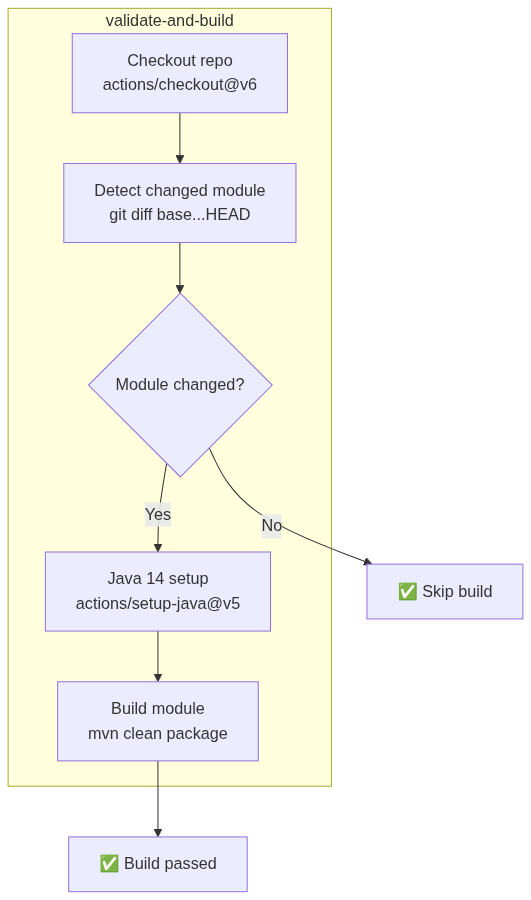
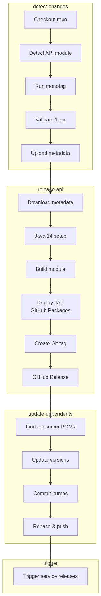
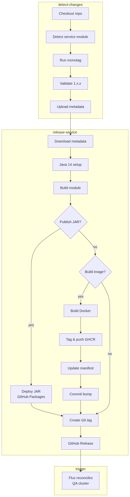
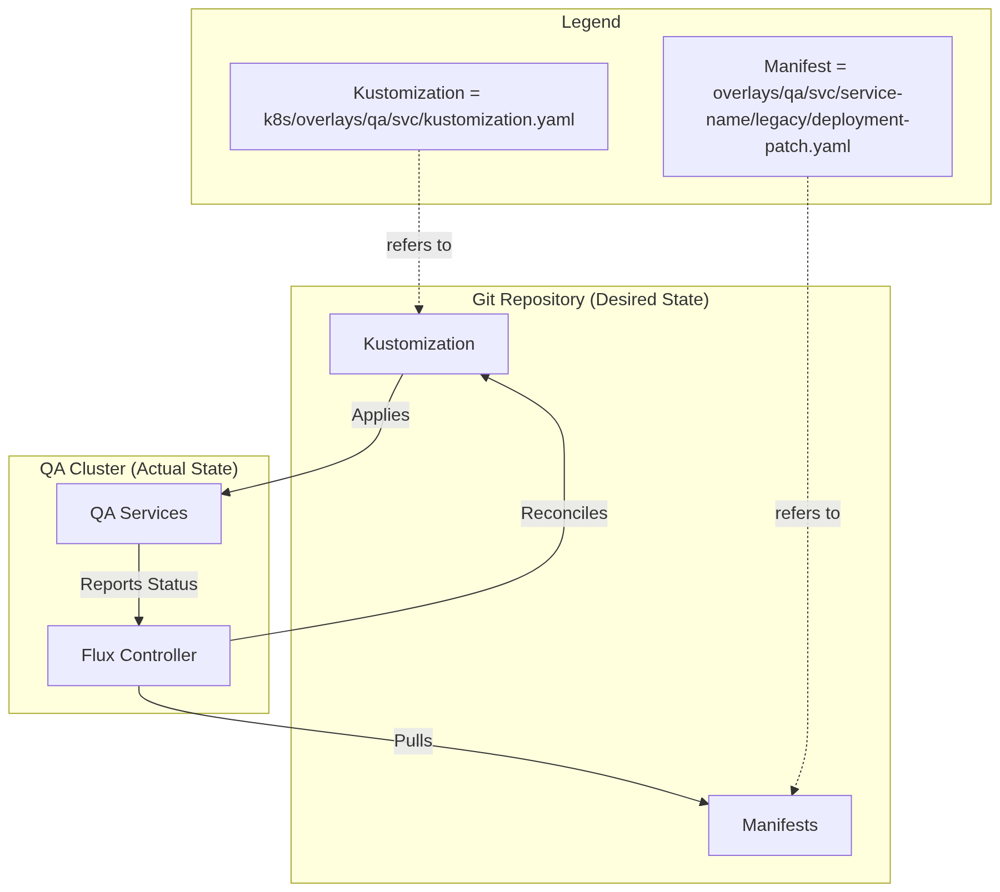

The previous [article](/article/lift-completed-now-shift-making-the-insurance-hub-kubernetes-native-enough/) concluded with the system successfully running on Kubernetes, yet it still relied on a manual deployment model. While validating the cluster foundation and service manifests was a significant milestone, it also revealed a lingering operational gap. I had migrated the platform to Kubernetes, but the delivery process remained manual—a compromise that prevented the system from fully embodying a cloud-native workload.

<!--more-->

This distinction is more critical than it might seem at first. Kubernetes offers declarative runtime primitives, service discovery, and repeatable scheduling, but it does not inherently make the release process declarative. At this point, I still needed to build, version, and publish images explicitly. Additionally, manifests required manual updates after every release. Although the cluster was configured to run the services, I felt that the process for deploying those workloads was still too manual to be considered complete.

This article addresses the final component of Phase 1, focusing on the CI/CD and GitOps work that I had postponed until now. I will utilize GitHub Actions for modular release workflows, GitHub Packages and GHCR for artifact publication, and Flux for cluster reconciliation based on the repository state.



### Phase 1 Scoping: Anchoring the Delivery Foundation

Before committing to the Phase 1 implementation, I conducted a comprehensive review of the project's scope and identified several critical gaps that needed to be addressed from the beginning. I realized that observability had to extend beyond the Insurance Hub services to include the underlying infrastructure itself. Additionally, it became evident that Zipkin and JSReports were completely absent from the initial deployment plan. I also determined that the integration of GitOps could no longer be postponed until Phase 6, as originally envisioned. As a result, I decided to incorporate the CI/CD and GitOps work into Phase 1. The reasoning was practical: while the initial effort produced a functional Kubernetes runtime, the platform would lack true operational completeness without a declarative delivery path.

This distinction proved crucial during execution. Although the services were successfully deployed into Kind and K3s clusters—with MinIO replacing local filesystems and PostgreSQL managing state—the operational model still felt incomplete. I found myself relying on orchestrated Make targets and manual image tagging instead of repository reconciliation. Without the integration of GitHub Actions, Flux, and GHCR, Phase 1 would have ended with a functional system that was not yet production-ready—it could run, but it could not reliably release itself.

This gap was particularly evident when considering the upcoming [Phase 4 Strangler Fig](https://github.com/igor-baiborodine/insurance-hub/blob/main/docs/system-overview-and-migration-analysis.md#phase-4-phased-service-migration-to-go-strangler-fig-pattern) migration. I anticipated that managing Java and Go versions through separate Kustomize overlays would quickly become an exercise in manual coordination. Therefore, I concluded that automated workflows for modular releases and Flux-based reconciliation were not just optimizations but essential requirements to ensure the platform remained self-consistent and scalable from the outset.

For the local development Kind cluster, I intentionally maintained the manual push model. This approach—building images locally and loading them into nodes via Make—aligns better with the iterative feedback loop I need during active coding. However, for the production-like QA environment running on K3s, I prioritized achieving full operational completeness through a proper delivery pipeline.

### Architecting the Delivery Path: From Requirements to Reconciliation

Transitioning from a manual “push” model to a GitOps-driven pipeline required a clear definition of what a “complete” delivery platform meant for a monorepo. Having spent most of my career outside the context of large-scale monorepos, I found it challenging to establish the objectives and select the right tools that could handle the complexities of cross-module dependencies. I needed a platform that did not just automate the path to production but also enforced the operational discipline I had established during the manual “shift” phase.

Specifically, the platform needed to satisfy five core requirements:

- **Automated PR Validation**: Every change, whether to a shared Java API module or a future Go service, must receive immediate feedback through linting and automated testing to catch regressions and style drift early.
- **Modular Release Flows**: I needed to establish independent pipelines for APIs, shared libraries, and services to manage the monorepo's dependency graph. This modularity ensures that a release of a shared module triggers updates only for its direct downstream consumers, preventing localized changes from causing an uncontrolled, full-stack re-release cycle.
- **Scalable Versioning**: The versioning strategy needed to be compatible with a monorepo and forward-compatible, ensuring that the eventual Java-to-Go migration would not disrupt our artifact history.
- **Unified Artifact Management**: A centralized location was necessary for publishing both JAR files for shared modules and container images for workloads.
- **Declarative Reconciliation**: Finally, the QA cluster state needed to be continuously reconciled with the repository.

Since the source code is hosted on GitHub, I chose to leverage the GitHub ecosystem extensively. Utilizing GitHub Actions (GHA) for continuous integration, along with GitHub Packages and the GitHub Container Registry (GHCR), was a practical choice that minimized integration friction. By keeping the delivery logic close to the code, I eliminated the need for external authentication and benefited from GHA's native support for monorepo-style path filtering. Additionally, using GHCR as our OCI-compliant registry provided a unified view of our images, which was essential for tracking the coexistence of legacy Java and future Go workloads.

For the GitOps reconciliation layer—specifically for the production-like QA environment—I selected [Flux CD](https://fluxcd.io). Initially, I considered the trade-offs between Flux and [Argo CD](https://argoproj.github.io/cd/). While Argo CD offers a rich user interface and sophisticated image automation, I ultimately chose Flux due to its "Git-centric" approach, which felt more lightweight and integrated seamlessly with Kustomize. Flux’s source controller and Kustomize controller allowed me to treat my manifests as the single source of truth, without the heavy scaffolding or management UI required by Argo. Since I was already managing my environment through structured Kustomize overlays, choosing Flux felt like a natural extension of my existing workflow rather than an additional layer of complexity to manage.

### CI/CD: Orchestrating Modular Releases

Before proceeding with the implementation of our CI/CD workflows, I gave careful thought to the underlying automation strategy. The Insurance Hub is a Maven monorepo where modules share a common Git history and depend on each other through internal APIs. This structure introduced three principal challenges: establishing a versioning strategy that works for both Java and future Go services, defining safety guardrails for inter-service dependency updates, and implementing automated version bumping driven by the commit history.

#### Module Versioning: Decoupling Release Cycle

I evaluated two primary versioning strategies for managing our modular monorepo: a **global repository version** and **independent per-service versioning**. Initially, the global "release train" approach seemed appealing due to its straightforward mental model—the entire platform would move from version `1.3.0` to `1.4.0` as a single unit. This model simplifies coordination for tightly coupled modules and keeps pipelines clear by avoiding a complex versioning matrix. However, it quickly became evident that this coarse-grained approach would introduce significant operational noise. Frequent, localized changes to a small service would necessitate a version bump across the entire stack, making it difficult to understand what had actually changed and triggering unnecessary builds for stable components.

Ultimately, I opted for independent semantic versioning for each module. This strategic choice aligns with the requirements of the Go module ecosystem for monorepos. In Go, a single repository containing multiple modules must use prefixed tags—such as `legacy/pricing-service-api/v1.2.3`—for the toolchain to correctly resolve sub-directories as dependencies. By adopting this pattern now for our Java APIs, I am laying the groundwork for a seamless migration to Go in the future.

This approach also reinforces independent service lifecycles, a core principle of the microservices architecture we are pursuing. Independent versioning ensures that consumers of the `product-service-api`, for example, are not forced to adopt updates they don't need, effectively decoupling release cycles and reducing the risk of creating a "distributed monolith." From a technical safety perspective, it eliminates race conditions in GitHub Actions; since each matrix job manages a unique, module-specific tag, multiple APIs can be built, tagged, and released in parallel without conflicting over the same Git reference.

To maintain clarity between project eras, I have restricted legacy Java API versions to the `1.x.x` range, reserving `2.0.0+` for future Go-based services. Additionally, I have decided to keep the Maven `pom.xml` versions at a static `1.0.0-SNAPSHOT` for legacy modules. This decision establishes a baseline while placing the burden of truth on Git tags, which serve as the only reliable indicator of what code is actually running in production.

#### Artifact Tagging: Balancing Traceability and Immutability

The versioning approach for container images needed to be both monorepo-friendly and forward-compatible. It required a strategy that balanced a human-readable release history with the technical immutability necessary for reliable Kubernetes deployments. During the research phase, I evaluated several tagging strategies to achieve this balance between readability and absolute technical traceability.

Initially, I considered a simple SemVer-only approach to keep the image registry organized. However, while Semantic Versioning (SemVer) is excellent for tracking the evolution of a module, it lacks the cryptographic certainty needed to link a running binary back to a specific Git commit. If a tag is accidentally overwritten—a common risk during manual interventions—the connection between source code and cluster state would be broken.

To mitigate this risk, I implemented a dual-tagging strategy that applies both a SemVer tag and a short Git SHA to every build. The SemVer tag provides a human-friendly timeline for release management, while the SHA tag serves as an immutable anchor. After testing this approach against our modular workflows, I decided to adopt it, despite the minor trade-off of increased registry size. In my view, the benefit of having a definitive mapping between a container in GHCR and a commit in Git outweighs the overhead of managing a more aggressive image retention policy.

#### Guardrails: Managing Dependency Propagation

To effectively manage the complex network of inter-API and service dependencies, I implemented a strict guardrail of “single-module-per-release.” This restriction ensures that each GitHub Action run is focused on a specific domain or service update, minimizing the risks associated with partial failures or “mixed” version releases. By enforcing this atomic approach, I can guarantee that each scoped Git tag serves as an accurate point-in-time reference for the lifecycle of a specific component.

Recognizing that the `policy-service-api` is a critical foundation for the entire system, I adopted an active propagation strategy to prevent dependency drift. When an API release is finalized, a specialized `update-dependents` job automatically scans the repository only for consumer service modules and updates their `pom.xml` versions accordingly. This change is then committed back to the main branch, triggering a sequential release of the dependent services and ensuring the system remains aligned with the latest contracts.

Additionally, I established structural guardrails to separate internal library logic from deployable artifacts. Infrastructure modules, such as `command-bus` and other API modules, are published strictly as JAR files to GitHub Packages. In contrast, business services directly build OCI-compliant Docker images for the GitHub Container Registry (GHCR) without going through this step. I also adopted the [Conventional Commits](https://www.conventionalcommits.org/en/v1.0.0/) standard to streamline this logic. By enforcing prefixes like `chore(k8s)` or `feat(svc)`, I enable the continuous integration process to automate versioning and provide a machine-readable audit trail explaining why a specific deployment changed. This ensures that our deployment history remains fully auditable and anchored in the repository as the sole source of truth.

#### Monorepo Workflows: From PR Gate to Release Automation

**Note:** The web release workflow follows the same pattern as the service workflow (`detect` → `build` → `publish` → `tag`), so only the service release workflow is shown.

  
<b>PR Validation: Enforcing Modular Discipline</b>

 

  
<b>API Releases: Building and Propagating Contracts</b>

 

  
<b>Service Releases: Automating Modular Delivery</b>

 
&nbsp;

For more details, please refer to this [commit](https://github.com/igor-baiborodine/insurance-hub/commit/471c51fc210a6932b9ad2f1ddeb46b16437faa07). 

### GitOps in QA: Keeping Flux Focused on Reconciliation

While the "shift" phase successfully confirmed that our services function as Kubernetes workloads, the deployment model was still dependent on a manual "push" loop. Using an organized series of Make targets to build, load, and apply manifests was a necessary intermediate step, but it did not meet the operational maturity I envisioned for Phase 1. To address this issue, I introduced [Flux CD](https://fluxcd.io) to manage the QA environment. This transition represents a shift from an operator-driven push—where I, as the human operator, had to manually trigger the delivery of manifests from my local machine—to a declarative pull model. In this new approach, the cluster itself takes responsibility for fetching and applying changes, making the Git repository the definitive source of truth for the cluster’s state.

In this architecture, Flux is focused solely on cluster reconciliation. It does not decide when to release; instead, it ensures that the cluster state matches what is declared in Git. The roles are clearly defined: GitHub Actions handles the complexities of building artifacts and updating manifest versions, while Flux serves as a reliable component that pulls those changes into the environment. This separation keeps our delivery pipeline "boring" and predictable—Flux doesn't need to manage Maven dependencies or OCI tagging strategies; it simply observes the repository and reconciles any differences.

  
<b>GitOps Workflow: Flux Reconciliation Loop</b>

 
&nbsp;

To support this GitOps workflow and maintain the reproducibility established in earlier phases, I
added several Flux-specific management [targets](https://github.com/igor-baiborodine/insurance-hub/blob/58679463b87cb2165002dd3b18099fc4dee6ab8d/k8s/Makefile#L228) 
to the `k8s/Makefile`:

- `flux-bootstrap` – Installs Flux components and connects the cluster to GitHub.
- `flux-reconcile` – Triggers an immediate pull and application of the latest Git state.
- `flux-suspend` – Pauses reconciliation to prevent Flux from overwriting manual cluster tweaks.
- `flux-status` – Provides a unified view of all Flux sources and kustomizations.
- `flux-uninstall` – Cleanly removes the GitOps controller from the cluster.

For more details, please refer to these commits: 
[21b266b](https://github.com/igor-baiborodine/insurance-hub/commit/21b266b25c5196ab3cb7f195c05e046fe529a993),
[a943656](https://github.com/igor-baiborodine/insurance-hub/commit/a9436566e08d96e6dff0bda424e43d834d5cbf5a),
[be4ba90](https://github.com/igor-baiborodine/insurance-hub/commit/be4ba906458b67defb936faefd1e6eb072149839).

### Release Strategy: Navigating Dependency Minefield

With the GitHub Actions workflows finalized and Flux reconciliation activated, the next logical step was to roll out the initial version to the QA cluster. However, the Insurance Hub is not just a collection of isolated binaries; it consists of a network of interdependent Maven modules. I realized early on that a "deploy all" approach would fail due to the strict ordering required by internal API consumers and implementation providers. To manage this complexity, I created a module dependency graph to visualize the hierarchy, which served as a blueprint for the release sequence.

[Module Dependency Graph Source PlantUML](https://github.com/igor-baiborodine/insurance-hub/blob/v1.0.0/docs/java-c4-diagrams/container/insurance-hub-maven-modules-dependency-diagram.puml)

[Generated Module Dependency Graph on www.plantuml.com](//www.plantuml.com/plantuml/png/XPR1RkCs48RlUeff3cq2rCcbfvvsDzwsAH8qY7VHOp2cnZ9RYbJ9ORP2qNTVKgASq6lIEGGQ-kTyv92_DEySesNVg-OxgONoBS6UUN0_tznO_7BTITxxhNTaXT5Ccg-5wMy6XJhEMJbkbTpUtFwqUen3dn_kRtfqJ3OCFT-66IWrsUiXvc_Str8FQB475KPv70YCvRrf6fQi21xmXJGycDQ7O4q3wPQq664jiOkpTiR2dNRUeXO4l_ajNDvJXsAyQfhD6AZzymVZTOjsl5JJ3yzzJFaZNCowZE0khk2_fe7mTvZL8TCN75sOyUly2FSuafsaaFuEsrhaGOqTQLuDnZAgLHg-2EDlWJ7-gDcEC1Yf6QpnB7K7blxnvDW16t1aNwGWUFzuvwulhYRc_qUBJ9guo4sIt_M3efuq8qkZNM6vWr4orCIzY31r3bOfsQcrFauAK797OXIAG9bEYhIguzGsJ1ESSgUecdoMW436a1TwrDXDMoW1f0Z5Ie0KrG7KIzy7W19UJNMfRW3724_vKrJB_ru8u_LqWAXRI3FSwUoEq8fzNlbvh8RugD2n5BCGf6xftmKtZvs6jUZsMuEsJRn3N6DjK94BgL6D4Ld8R8H_KwKbTDLpMFy27ONPqn7CYsTZiQFJ3FIy52e-LeyW_1xmKhoc_ltFJxLJ5djS5XyVQycVA3YPPKyGbR3pMaGAAibZoPauoEZAO5xu7ZPxjDIcZ6Si6IP-OybL6ApOSltf3pTjMMeckqD1hchDn4ZHMSWiAr3A_aoK59sbpB82fUpIH4dHMSeiAr3ARasGtArrr6PI5KWrgoRO8Ju7MY_20gjYteJAp5j59M69TCfcVVkyzT4AmlHzcB8AqQdSTtfdqR7rWhsbwGEVPi0-_5DITm5H9iIzv9JIBcwFqW9k0nSdJx_vqWP7_m3BfxzTMX193YwVZ6UQFjAerFI1lcgUIBqs0PcNv_R5WT4NHxBCZnLTvgYABlD4HPVTwh8ikoPLONvtSsMeujARi8d5oeeP4sNTI5QwGpFZ4Z9JPbMvHQLEgLulu6T7KH0LUPEIWXFC94wWZ5eIPzr32agxoRJPnfzeHvQqEAmuwnlcvqBMfAmcpPIrEXqr48UmmCxqLNmchguWQpIMgCZFr7LyhitfjNJXERlZSCda69mm0rt55qmCvuk_l6e-UFVjhK_40xf-v-ElcJHRQJhAYYWhU4KNLdrupKUpke64t4c1IetGlcuwzHvH4j_LRcvnMjEZr62sVv5WbzSmO6flnkPTUFQz-We0)

Initially, I considered a simultaneous release, but the inter-module dependencies made this impractical. The system relies on a "bottom-up" propagation model, meaning that shared contracts (APIs) must exist in the artifact registry before implementation services can successfully compile and link against them.

| Release Tier          | Modules                                                                  | Rationale & Procedure                                                                                                                         |
|:----------------------|:-------------------------------------------------------------------------|:----------------------------------------------------------------------------------------------------------------------------------------------|
| **1. Foundation**     | `auth-service`, `chat-service`, `command-bus-api`                        | Standalone identity and isolated messaging services. `command-bus-api` is the fundamental contract that triggers the `update-dependents` job. |
| **2. Core Infra**     | `command-bus`                                                            | Released once the CI has automatically bumped the version in its `pom.xml` following the API update.                                          |
| **3. Domain APIs**    | `policy-service-api`, `product-service-api`, `pricing-service-api`, etc. | Must be released in a specific sub-order (e.g., `policy-api` before `documents-api`). Each push triggers JAR publication to GitHub Packages.  |
| **4. Implementation** | `policy-service`, `pricing-service`, `payment-service`, etc.             | These are triggered by auto-commits from the API tier. They consume the newly published JARs and produce OCI-compliant images for GHCR.       |
| **5. Edge/Gateway**   | `agent-portal-gateway`, `web-vue`                                        | The final consumers. The gateway is released last as it depends on nearly all backend APIs to route traffic correctly.                        |

This order is guided by the propagation logic I implemented in the CI process. When a change is pushed to a module like `policy-service-api`, the `legacy-release-api.yaml` workflow publishes the new JAR file and identifies any downstream services that require a version bump. However, I intentionally blocked automatic version bumping among dependent APIs—such as `documents-service-api` referencing `policy-service-api`—to prevent uncontrolled cascading releases within the contract layer. This decision ensures that the version in the dependent API's `pom.xml` is manually and explicitly updated before pushing, which requires that any changes to core domain objects be intentionally reviewed and acknowledged by downstream contract owners.

To trigger these releases in a controlled manner, I adopted a pattern of "chore" commits. Since I am maintaining a static `1.0.0-SNAPSHOT` in the `pom.xml` to avoid version churn, I needed a way to signal to GitHub Actions that a specific module was ready for formal release. For APIs, this typically involved making a trivial change—like adding a comment to the `pom.xml`—with a commit message formatted as `chore(command-bus-api): first release`. This approach effectively "pokes" the workflow for that specific path.

For the final service rollout, the process required an additional step to integrate the service into the GitOps reconciliation loop. For example, with the `agent-portal-gateway`, the release was triggered by two concurrent actions: adding the release-triggering comment to the service's `pom.xml` and uncommenting the service resource in the `k8s/overlays/qa/svc/kustomization.yaml` file. This ensured that as soon as the OCI image was published to GHCR, Flux was already authorized and instructed to pull the new workload into the `qa-svc` namespace.

This sequence transformed the first deployment from a simple command into a validation of the entire delivery architecture. By the time the gateway was successfully reconciled by Flux, I had verified not only the service code but also the automated versioning, the artifact registry permissions, and the dependency propagation logic. The first release confirmed that the monorepo could self-coordinate, turning a complex dependency exercise into a repeatable, straightforward operational routine.

### Pragmatic Automation: What I Deliberately Postponed

The introduction of Flux and GitHub Actions marks a significant advancement in the maturity of the Insurance Hub. However, I made several deliberate choices to limit the scope of automation for Phase 1. My primary goal was to establish a stable and clear delivery path instead of an overly sophisticated one. Given the complexity of a monorepo undergoing foundational changes, I felt it was necessary to maintain manual checkpoints to ensure that every architectural change was intentional and verified.

Initially, I considered using Flux’s image automation to automatically update manifests whenever a new OCI image was pushed to GHCR. However, after testing the modular release flows, I decided against implementing this feature for this phase. Automated image updates can obscure the relationship between a code change and a cluster state change, making troubleshooting significantly more difficult. By requiring an explicit "chore" commit to update the image tag in the Kustomize overlay, I maintain a clear, human-readable audit trail in Git. Keeping this step manual ensures I am always aware of exactly which version is being reconciled into the QA environment.

Additionally, I chose not to implement a complex multi-loop delivery system or premature promotion orchestration. While it might be tempting to create automated pipelines that "promote" manifests across multiple environments, I decided to treat each target environment as a distinct entity with its own explicit configuration. This "QA-first" approach for GitOps ensures that the delivery pipeline is thoroughly tested in the most production-like environment—the K3s cluster—before considering the added complexity of cross-environment synchronization in the future. I adopted this focused strategy to avoid "configuration gravity," where the complexity of the delivery tool influences architectural choices rather than supporting them.

Maintaining an explicit system was the right trade-off for Phase 1. It allowed me to validate the core mechanics—specifically the GitHub Actions matrix jobs, the internal API JAR publication, and the Flux reconciliation loop—without the complications of fully autonomous updates. By anchoring every deployment to a deliberate Git commit, I’ve ensured the platform remains self-consistent. The automation I did implement addresses the challenging problems of monorepo dependency propagation, while the automation I postponed allows me to maintain the operational clarity I need as I prepare for the more dynamic Phase 4 migration.

### Phase 1 Completion: Bridging Operational Gap

The implementation of GitOps reconciliation and modular release workflows marks the formal conclusion of Phase 1. Initially, my roadmap envisioned a more linear progression—provisioning the infrastructure, shifting the services, and then eventually automating the delivery. However, as the complexity of the monorepo became apparent, I chose to pull the GitOps work forward. This decision was pragmatic: by establishing a declarative delivery path now, I have anchored the entire legacy stack to a version-controlled source of truth.

The platform now embodies a complete, cloud-native foundation for the Insurance Hub. This includes the dual Kind and K3s clusters, a full suite of containerized stateful infrastructure, and all ten legacy Java microservices running with Kubernetes-native service discovery and S3-compatible storage. Most importantly, the manual "push" model has been replaced by Git-driven reconciliation. Every component—from the PostgreSQL operators to the agent portal gateway—is now managed through structured Kustomize overlays and synchronized by Flux.

This transition significantly reduces operational risk for the upcoming phases of the migration. As I move toward the data store consolidation and the eventual Java-to-Go "Strangler Fig" migration, the delivery pipeline will act as a safety net. I can now iterate on service implementations with the confidence that the environment state is predictable and reproducible. The burden of manual coordination has been shifted to the automation, allowing me to focus on the architectural logic rather than the mechanics of deployment.

With the foundation stable, the focus shifts to maturing our platform's visibility. The next stage—Phase 2—will center on maturing our foundational observability stack. I will be integrating OpenTelemetry to bridge our legacy tracing into a unified Grafana Tempo backend, setting the stage for the more dynamic service-by-service Go migration that follows.

Continue reading the series ["Insurance Hub: The Way to Go"](/series/insurance-hub-the-way-to-go/):

