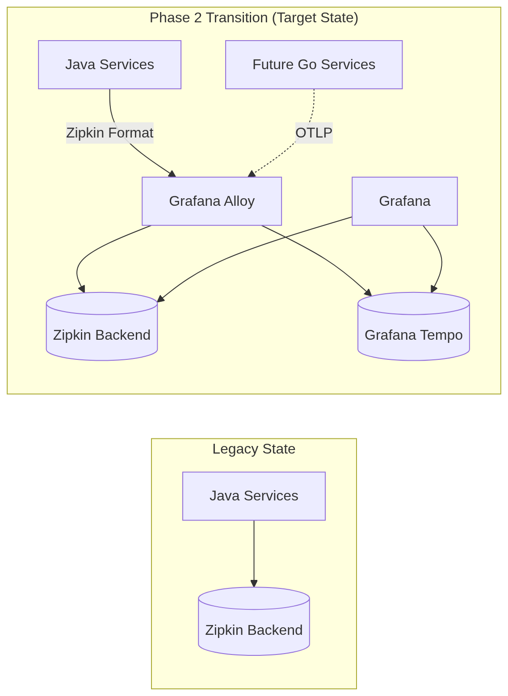

After [Phase 1](https://github.com/igor-baiborodine/insurance-hub/blob/main/docs/system-overview-and-migration-analysis.md#phase-1-foundational-infrastructure--environment-migration-lift-and-shift), 
the Insurance Hub had established a Kubernetes runtime and a GitOps delivery loop that functioned reliably in the QA K3s environment. This successfully closed the operational gap around deployments, but it also highlighted another issue. Although the platform could be reconciled from Git, the tools for understanding cross-service behavior were still confined to a legacy setup.

<!--more-->

Zipkin tracing was in place and operational; however, it was limited to a single backend and an outdated version of the system. 
[Phase 4](https://github.com/igor-baiborodine/insurance-hub/blob/main/docs/system-overview-and-migration-analysis.md#phase-4-phased-service-migration-to-go-strangler-fig-pattern) 
won't involve a clean cutover; instead, it is designed to operate in a mixed state where some services are still in legacy Java while others have migrated to Go. Consequently, requests will frequently cross this boundary. During this hybrid period, it is crucial for distributed traces to converge in one location; otherwise, troubleshooting can become a challenging task of piecing together fragmented views.

[Phase 2](https://github.com/igor-baiborodine/insurance-hub/blob/main/docs/system-overview-and-migration-analysis.md#phase-2-foundational-observability) 
directly addresses this constraint. The goal is to establish Grafana Tempo as the primary tracing backend early on, all while ensuring that there are no changes to the existing Java services. To achieve this, I introduced Grafana Alloy as a permanent telemetry gateway across the cluster. Alloy receives Zipkin-format traces from the legacy services and exports them to both Zipkin and Tempo during this transition. Zipkin serves as a baseline and safety net, while Tempo will be the singular repository capable of spanning both Java and Go services as the migration unfolds.

In this phase, Grafana Loki is also deployed, but we intentionally refrain from enabling log ingestion. Loki is viewed as part of the target stack and a prerequisite for Phase 4, rather than a complete logging rollout. The focus here is clear and intentional: set up Tempo, place Alloy in front of it, validate end-to-end dual-writing, and strengthen the QA K3s provisioning steps to ensure that the entire observability installation is repeatable.



### Phase 2 Scoping: Establishing Observability Foundation

Phase 2 was designed as a strategic bridge between the initial Kubernetes migration and the forthcoming service rewrites. The primary objective was to modernize the telemetry backend while keeping the Java services unchanged. By establishing a robust tracing and logging foundation early on, I ensured that the hybrid environment—where legacy Java services and new Go services will eventually coexist—would have a unified "single pane of glass" for troubleshooting.

The development work was managed through a dedicated [Epic](https://github.com/igor-baiborodine/insurance-hub/issues/79#issue-4376197009) 
in GitHub Projects, which was divided into four child tickets. I focused on setting up the core Grafana stack and implementing a centralized collection layer that decoupled the applications from their telemetry backends.

| Ticket                                                                                          | Deliverable                            | Description                                                                                                                    |
|:------------------------------------------------------------------------------------------------|:---------------------------------------|:-------------------------------------------------------------------------------------------------------------------------------|
| **[[1]issue-80](https://github.com/igor-baiborodine/insurance-hub/issues/80#issue-4376712516)** | **Grafana Loki Installation**          | Deploy Loki in the QA cluster with MinIO-backed storage to serve as the future target for centralized log aggregation.         |
| **[[2]issue-81](https://github.com/igor-baiborodine/insurance-hub/issues/81#issue-4376717776)** | **Grafana Tempo Installation**         | Set up Tempo as the primary tracing store, providing a scalable, S3-compatible alternative to the legacy Zipkin backend.       |
| **[[3]issue-82](https://github.com/igor-baiborodine/insurance-hub/issues/82#issue-4379324528)** | **Grafana Alloy Deployment**           | Implement Alloy as a permanent telemetry gateway to ingest legacy traces and route them into the modern stack.                 |
| **[[4]issue-86](https://github.com/igor-baiborodine/insurance-hub/issues/86#issue-4425327776)** | **QA Cluster Provisioning Refinement** | Update Make targets and infrastructure automation to handle the increased resource footprints of the observability components. |

In this phase, the focus was primarily on infrastructure. I regarded the installation of Loki and Tempo as essential for the long-term health of the platform, ensuring that our storage strategy remained aligned with the MinIO-based approach established in Phase 1. The introduction of Grafana Alloy allowed me to validate the end-to-end trace flow from existing Java services into Tempo, effectively strengthening the observability pipeline even before any Go code was written. This proactive setup minimizes operational risks in Phase 4, as the monitoring environment is already mature and ready to receive OTLP signals.

### Gateway Pivot: Decoupling Tracing with Grafana Alloy

Initially, my plan for Phase 2 was to use a standard OpenTelemetry Collector as a temporary bridge, intending to decommission it once our new Go services could send traces directly to Tempo. However, after researching OpenTelemetry best practices and the architectural requirements for a multi-language cluster, I decided to switch to **Grafana Alloy** as the permanent telemetry gateway.

This decision was a strategic pivot rather than just a preference for different tools. The core issue wasn't solely Zipkin; it was that our telemetry pipeline was tightly coupled to specific backends. By implementing Alloy as a permanent infrastructure layer, I’ve established what I refer to as a "permanent contract" for the cluster. Alloy provides stable, cluster-wide endpoints for both legacy Zipkin traffic and modern OTLP signals. This allows us to evolve our backend storage from Zipkin to Tempo without needing to modify the service-level instrumentation again. Additionally, since our entire modern stack is centered around Grafana, Alloy acts as the native connector that ensures seamless correlation between logs, metrics, and traces within the same ecosystem.

#### Trace Flow Transition: The Dual-Write Strategy

During this phase, the architecture of our trace flow experienced a major transformation. In the legacy state, services communicated directly with the Zipkin backend. In the new Phase 2 state, Alloy takes center stage, functioning as a traffic controller for the flow of information.

  
<b>Flow Transition: From Legacy to Target State</b>

 
&nbsp;

I chose to implement a dual-write strategy in which Alloy forwards traces to both Zipkin and Tempo simultaneously. This approach was justified despite the added complexity for three main reasons:

1.  **Zero Blast Radius**: Zipkin remains the primary safety net. If Tempo or the MinIO backing store struggles under load, the existing debugging workflow remains untouched.
2. **Side-by-Side Validation**: We can compare the same traces in the legacy Zipkin UI and the new Grafana-first Tempo dashboards. This allows us to ensure that no data is being lost or distorted during the OTLP translation.
3. **The Clean Flip**: This setup offers a straightforward path for decommissioning. Once we are confident in Tempo's retention and performance, we can simply remove the Zipkin exporter from the Alloy configuration. This change can be made without service restarts or code modifications.

This transition effectively decouples our telemetry "producers" from the "consumers," transforming observability from a hard-coded dependency into a manageable infrastructure service.

### Grafana-centered Observability: Implementing Logging and Tracing

Completing the observability pillars for the QA K3s cluster is a critical objective for Phase 2. While the initial setup provided basic metrics through the Kube Prometheus Stack, we lacked a unified method for log aggregation and advanced trace analysis. This absence of integration made cross-service correlation challenging during troubleshooting.

#### Loki

The legacy Java services do not have any centralized logging capabilities, resulting in fragmented console output that requires manual, ad-hoc aggregation. As we transition these services to Go in the future, I have prioritized establishing a robust logging foundation. Given our Grafana-centered stack, [Loki](https://grafana.com/oss/loki/) was the logical choice for log aggregation. It follows the same label-based indexing philosophy as Prometheus, avoiding the high resource overhead associated with full-text indexing while providing the query performance necessary for rapid incident response.

The deployment utilizes a dedicated MinIO tenant for Loki, provisioned through our established operator patterns to ensure that log storage is both isolated and scalable. I integrated Loki into the QA cluster using a streamlined set of [Makefile targets](https://github.com/igor-baiborodine/insurance-hub/blob/9c359a474ec83ce202d08d8d8ae8a0944491b42a/k8s/Makefile#L357) to manage its lifecycle and access.
- `loki-install` – Deploys Grafana Loki via Helm chart into the `qa-monitoring` namespace.
- `loki-status` – Validates the health of Loki pods and services.
- `loki-ui` – Establishes a port-forward to the Loki HTTP API for direct querying.
- `loki-uninstall` – Removes the Loki deployment from the cluster.

To ensure the persistence layer is reliable, I wrote a dedicated runbook to validate that logs are correctly pushed via the HTTP API and stored as objects in the `loki-logs` MinIO bucket. This verification process—including the specific `curl` commands and expected JSON responses—is detailed in ["Verify Loki Logs"](https://github.com/igor-baiborodine/insurance-hub/blob/main/k8s/tests/infra/verify-loki-logs/verify-loki-logs.md) guide providing a repeatable method to confirm that our logging infrastructure is both accessible and production-ready.

#### Tempo

The legacy Java environment uses Zipkin for distributed tracing, storing spans in Elasticsearch. While this setup provides basic visibility, it operates as a silo, making it challenging to correlate with our emerging metrics and logs. To unify our observability data, we have integrated [Tempo](https://grafana.com/oss/tempo/) as our new high-scale trace storage backend. Tempo is designed to store large volumes of trace data cost-effectively by utilizing object storage, which aligns perfectly with our transition to S3-compatible persistence.

Similar to our logging system, Tempo is deployed with a dedicated MinIO tenant to ensure storage isolation and independent scaling. I have added several [Makefile targets](https://github.com/igor-baiborodine/insurance-hub/blob/9c359a474ec83ce202d08d8d8ae8a0944491b42a/k8s/Makefile#L398) to the QA cluster configuration to automate the deployment and operational checks of the tracing backend.
- `tempo-install` – Deploys Grafana Tempo via Helm chart into the `qa-monitoring` namespace.
- `tempo-status` – Reports on the readiness of Tempo pods and their associated services.
- `tempo-ui` – Sets up a port-forward to the Tempo HTTP API for troubleshooting and direct trace retrieval.
- `tempo-uninstall` – Removes Tempo resources from the cluster during clean-up operations.

To validate the integration, I created a technical runbook that demonstrates the complete trace flow. This process involves sending synthetic OTLP spans via a `curl` command and confirming their presence in the `tempo-traces` MinIO bucket and the Grafana UI. The full verification steps, documented in ["Verify Tempo Traces,"](https://github.com/igor-baiborodine/insurance-hub/blob/main/k8s/tests/infra/verify-tempo-traces/verify-tempo-traces.md) ensure that our tracing pipeline is ready to ingest data from both legacy systems and future Go services.

#### Alloy

With Loki and Tempo serving as our storage backends, the final requirement for Phase 2 was a unified telemetry collector. While a standalone OpenTelemetry Collector was initially considered, I opted for [Grafana Alloy](https://grafana.com/oss/alloy/) to serve as our primary cluster-wide pipeline. Alloy acts as the critical bridge between our legacy Java services and the modern observability stack, handling the ingestion, processing, and routing of all telemetry signals from a single, programmable agent.

Alloy is deployed as a central service in the `qa-monitoring` namespace. It is configured to receive Zipkin spans from our legacy services and OTLP data from our new Go services. This consolidation removes the need to handle multiple disparate collectors, simplifying our infrastructure footprint. I have also introduced several [Makefile targets](https://github.com/igor-baiborodine/insurance-hub/blob/9c359a474ec83ce202d08d8d8ae8a0944491b42a/k8s/Makefile#L439) to manage Alloy's lifecycle within the cluster.
- `alloy-install` – Deploys Grafana Alloy via Helm chart with our custom pipelines.
- `alloy-status` – Validates that the Alloy pods and ingestion services are healthy.
- `alloy-ui` – Forwards the Alloy dashboard for real-time pipeline debugging and component inspection.
- `alloy-uninstall` – Removes the Alloy agent from the monitoring namespace.

To verify the integrity of the pipeline, I developed a runbook that tests the end-to-end flow of traces through the collector. By sending spans to Alloy’s receivers and monitoring their successful propagation to Tempo, we ensure that our telemetry system is correctly configured. This setup, outlined in the ["Verify Alloy Traces"](https://github.com/igor-baiborodine/insurance-hub/blob/main/k8s/tests/infra/verify-alloy-traces/verify-alloy-traces.md) guide, gives us the confidence to proceed with the full service migration, knowing that our observability bridge is stable and production-ready. 

### QA Cluster: Stabilizing Infrastructure Bootstraps

Throughout Phase 2, the reliability of our QA environment—operating on K3s—became a primary focus as we automated the deployment of the complete observability stack. Transitioning from manual installations to codified Make targets, I encountered a persistent issue: CRD-based stacks like CloudNativePG, Prometheus, and Strimzi often failed in subtle, non-deterministic ways. These failures typically occurred during the initial bootstrap of the cluster, when the Kubernetes API server had not yet fully registered or processed a Custom Resource Definition (CRD) before a dependent Custom Resource (CR) was applied.

Initially, these race conditions manifested as flaky automation results or false negatives during deployment. After experimenting with various methods to sequence these dependencies, I concluded that simply layering Helm charts or Kustomize manifests was inadequate. A successful deployment requires waiting until the CRDs are explicitly in an `Established` state and ready for use by the API server. This ensures that the control plane can validate and persist subsequent resources without encountering transient errors that disrupt the GitOps flow.

I refactored the infrastructure deployment targets to include explicit readiness checks using `kubectl wait` and iterative status polling. For instance, when deploying the CloudNativePG operator for our PostgreSQL clusters, the automation now pauses until the `clusters.postgresql.cnpg.io` CRD is established. We then poll to ensure that the API server positively responds to a `get` request for that resource type. This shift from a "fire and forget" approach to a deterministic readiness strategy has stabilized our bootstrap process, making observability installations repeatable across multiple cluster teardowns.

Additionally, I simplified the physical topology of the QA environment. Initially, the cluster was designed with separate master and worker nodes; however, I later implemented an optional single-node architecture to streamline the development cycle. The primary reason for this change was to accelerate the testing of new cluster provisioning modifications by reducing the overhead of managing multiple LXD containers. By removing default taints from the master node to allow workload scheduling, I created a more efficient and responsive environment for our Phase 2 validation without sacrificing the integrity of the multi-namespace monitoring stack.

### AI Usage: Transitioning to Spec-First Engineering

As I mentioned in the 
[opening](/article/from-java-to-go-kicking-off-the-insurance-hub-transformation/#ai-integration-accelerating-technical-research) 
of this series:

> To boost my learning and productivity, I make strategic use of modern AI tools—with clear boundaries. My main goal is to master Go and its ecosystem, not to let AI write code for me or fall into the trap of “vibe-coding,” where agents produce all the output. Instead, I treat AI as an advanced research tool—a “Stack Overflow on steroids”—for questions, documentation, and best practices. I focus on writing the code myself.

During Phase 2, my interaction with these tools changed significantly. Initially, I used AI primarily as a "chat companion" for fragmented queries. However, after experimenting with more structured workflows, I shifted to a specification-first, agent-based approach. This method aligns AI prompts directly with GitHub tickets and explicit acceptance criteria, ensuring that the generated suggestions are grounded in the specific requirements of the project. By providing the LLM with the technical context of our current environment—such as existing Make targets and Kubernetes namespace conventions—I have been able to maintain a consistent development pace while keeping the technical direction firmly under my control.

It is important to note that this agentic workflow is still a work in progress. I am refining the boundaries between my manual engineering efforts and automated assistance to ensure the highest standards of code quality and architectural integrity. I will provide more detailed insights and a final analysis of this methodology in upcoming articles, once the patterns for our Go service migration have been fully finalized.

### Phase 2 Completion: Securing Observability Safety Layer

Phase 2 concludes with a significantly improved observability foundation, transforming our distributed system from a collection of "black boxes" into a transparent and queryable environment. We have successfully deployed Tempo to receive and store traces, while Grafana Alloy now acts as our permanent telemetry gateway, dual-writing spans to both the legacy Zipkin and the modern Tempo backends for continuity. Additionally, our QA cluster provisioning is now deterministic, ensuring that CRD-based stacks are fully established before applying their custom resources. Although Loki is currently deployed only as a placeholder, we have validated the integration patterns for our structured logging.

This observability stack serves as a critical safety layer for the upcoming technical transitions. As we move into Phase 3, which involves consolidating our data stores, we will rely on these telemetry signals to monitor the integrity of our ETL scripts and the performance of our new PostgreSQL JSONB schemas. By migrating our product data away from MongoDB now, we reduce the operational complexity of the system before starting the high-risk language migration to Go. With full trace visibility in place, we can execute these database refactors with confidence, knowing that any regressions in inter-service communication or data latency will be immediately visible.

Continue reading the series ["Insurance Hub: The Way to Go"](/series/insurance-hub-the-way-to-go/):

